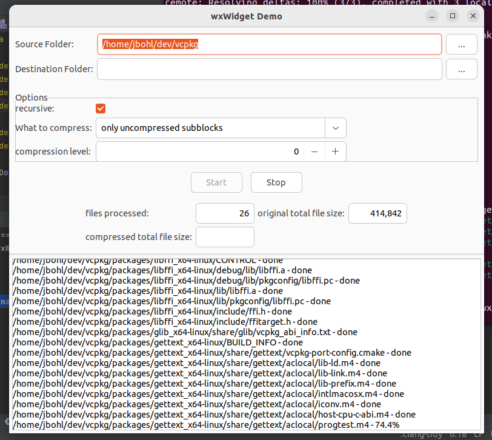

# libCZIrw
***A finger-exercise with wxWidget and cross-platform UI (in C++)***
--------------------------------------------------------------

## General Information
 
This application does nothing useful, it is just a finger-exercise and experimental.



The repo contains a [GitHub Workflow](https://docs.github.com/en/actions/using-workflows) which can build the application for Linux, Windows and MacOS.

## Building

For Windows, the recommended approach is to use [vcpkg](https://github.com/microsoft/vcpkg). 
In order to prepare wxWiget, this command should do the job

```
 .\vcpkg.exe install wxwidgets:x64-windows
 ```

 On (Debian based) Linux, this should do the trick:

 ```
 sudo apt install libwxgtk3.0-gtk3-dev
 ```