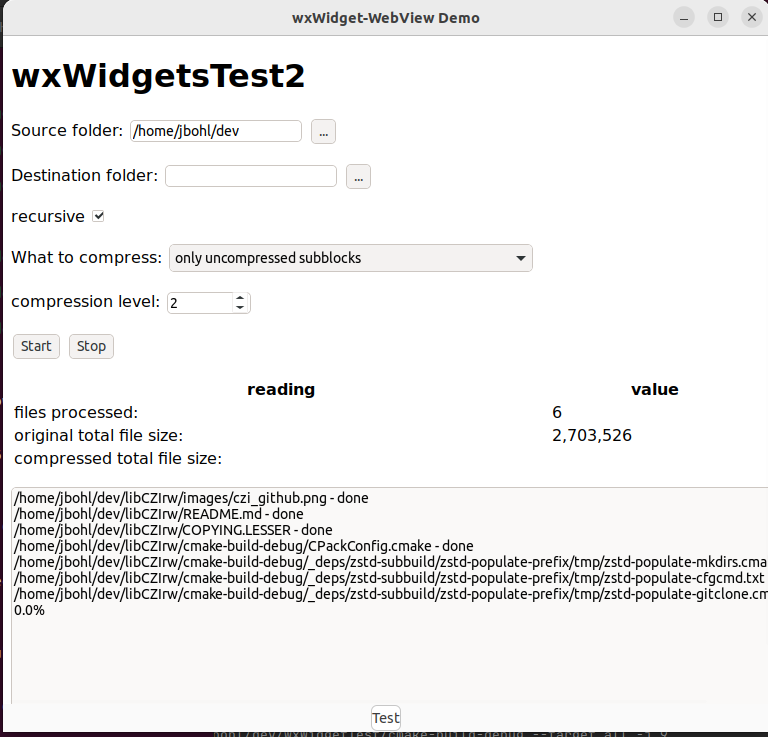

# wxWidgetTest
***A finger-exercise with wxWidget and cross-platform UI (in C++)***
--------------------------------------------------------------

## General Information
 
This application does nothing useful, it is just a finger-exercise and experimental.


Another experiment is found in the foloder wxWidgetsTest2 - here we use wxWidgets' [web-view control](https://docs.wxwidgets.org/trunk/classwx_web_view.html) where the
UI is defined in HTML/CSS/Javascript and hosted in a wxWidgets-based application.



Note: wxWidgetsTest2 requires the DLL "WebView2Loader.dll" being present - this needs to be copied by hand currently. Please see above link.

The repo contains a [GitHub Workflow](https://docs.github.com/en/actions/using-workflows) which can build the application for Linux, Windows and MacOS.

## Building

For Windows, the recommended approach is to use [vcpkg](https://github.com/microsoft/vcpkg). 
In order to prepare [wxWigets](https://www.wxwidgets.org/), this command should do the job

```
 .\vcpkg.exe install wxwidgets:x64-windows
 ```

 On (Debian based) Linux, this should do the trick:

 ```
 sudo apt install libwxgtk3.0-gtk3-dev
 ```